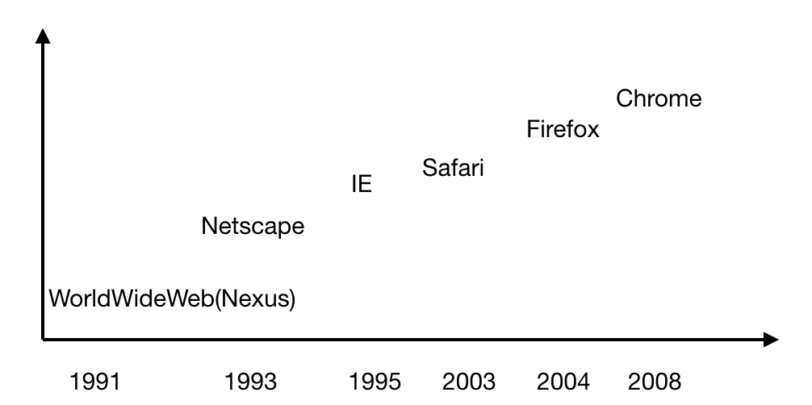
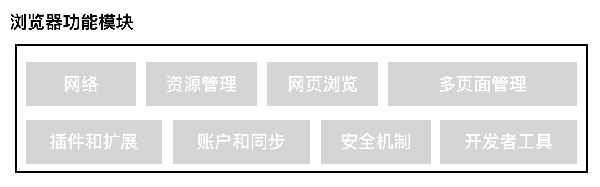
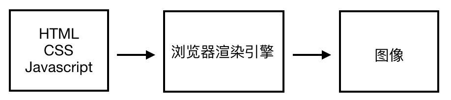
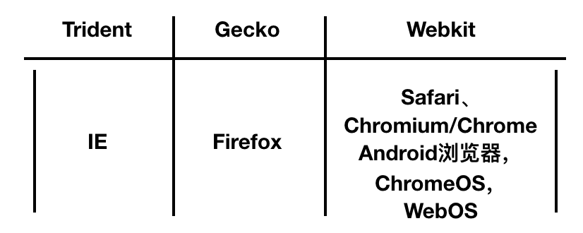
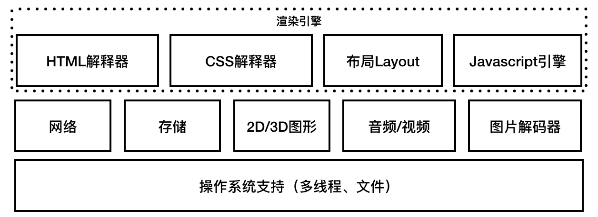
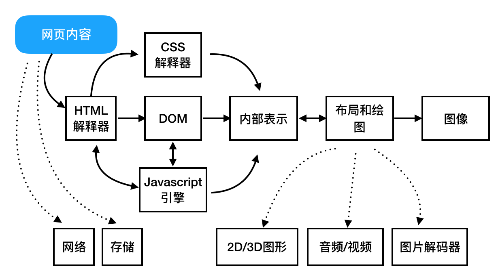

# 浏览器和浏览器内核
------

#### 一. 浏览器

##### 1.1 浏览器发展史

##### 1.2 浏览器功能

* 网络： 浏览器最重要的功能，通过网络模块，下载各种资源（html文本，js代码，样式表，图片，音视频等）。
* 资源管理：管理来自网络/本地的资源，实现如何避免重复下载，缓存资源等。
* 网页浏览：浏览器核心功能，它通过网络下载资源并从资源管理器获取资源，将它们转换为可视化结果。
* 多页面管理：使用线程/进程 绘制网页。
* 插件和扩展：插件功能用来显示网页特定内容，扩展增加浏览器新功能。
* 账户和同步：负责将浏览器相关信息（例如：历史记录，书签等信息）同步到服务器。
* 安全机制：负责提供一个安全的浏览器环境。
* 开发者工具：提供审核HTML元素、调试Javascript代码，改善网页性能等。

#### 二. 浏览器内核及特性

##### 2.1 浏览器内核

浏览器内核是浏览器中最重要的一个模块，它主要作用是将页面转化为可视化/可听化的图形结果。
浏览器内核也被称为渲染引擎，上图所示，浏览器渲染引擎能够将HTML/CSS/JavaScript文本及其相应资源文件转换为图像结果。

##### 2.2 浏览器和Web平台及其渲染引擎

##### 2.3 渲染引擎模块和其依赖的模块

>一个渲染引擎主要包括：HTML解释器、CSS解释器、布局、Javascript引擎。

* HTML解释器：解释HTML文本的解释器，将HTML文本解释成DOM树。
* CSS解释器：级联样式表的解释器，它的作用是为DOM中的元素对象计算出样式信息，从而为计算最后网页的布局提供基础设施。
* 布局：DOM创建后，Webkit需要将其中的元素对象和样式信息结合起来，计算它们的大小和布局信息，形成一个能够表示这些信息的内部表示模型。
* Javascript引擎：通过解释js代码并通过DOM接口和CSSOM接口来修改网页内容和样式信息，从而改变渲染的结果。
* 绘图：使用图形库将布局计算后的各个网页的节点绘制成图像结果。

##### 2.4 一般渲染过程

* 网页内容输入到HTML解释器，`HTML解释器`在解释它后构建成一颗DOM树，这期间如果遇到Javascript代码，则交给 `Javascript引擎`去处理；如果遇到CSS代码则交给 `CSS解释器`去处理。当DOM建立的时候，渲染引擎接收来自CSS解释器的样式信息，构建一个新的 `内部绘图模型`。该模型由 `布局模块`计算出内部各个元素的位置和大小信息，最后由 `绘图模块`完成从模型到图像的绘制。

#### 三. Webkit内核

[返回顶端](#浏览器和浏览器内核) [返回目录](../README.md)